# 个人通信录管理系统 — 项目展示文档

> **计算机类 3 班 · 黄湘林 · 学号 202530450655**
> 高级语言程序设计 II · 课程大作业答辩材料

---

## 目录

| 章节 | 内容 |
|:---|------|
| 一 | 项目概述与任务完成情况 |
| 二 | 面向对象架构设计 |
| 三 | 核心功能实现 |
| 四 | 操作界面展示 |
| 五 | 创新与扩展 |
| 六 | 踩坑与反思 |
| 七 | 总结 |

---

## 一、项目概述与任务完成情况

### 1.1 项目简介

本程序是一个基于 **C++17** 的个人通信录管理系统，管理**同学、同事、朋友、亲戚**四类联系人。每条记录包含姓名、生日、电话、邮箱，以及分类专属字段。

> 终端版一行命令编译即用，UI 版双击 `run.bat` 自动构建启动，两版共用同一份业务逻辑代码 `Core.hpp`。

### 1.2 技术概况

| 项目 | 说明 |
|------|------|
| 语言标准 | C++17 |
| 核心行数 | Core.hpp ~500 行 / 终端入口 ~200 行 / UI 入口 ~1200 行 |
| 构建工具 | CMake（UI 版）/ g++ 直接编译（终端版） |
| 图形框架 | Qt6（Widgets + Network） |
| 外部依赖 | DeepSeek API（AI 交互，可选） |

### 1.3 任务书要求完成情况对照表

| # | 任务要求 | 实现方式 | 对应位置 | 完成 |
|:--|----------|----------|----------|:--:|
| ① | 录入/修改（姓名生日除外）/删除 | 表单对话框+菜单输入；修改时姓名生日字段锁定灰色 | `onAdd` / `onEdit` / `onDelete` | ✅ |
| ② | 按姓名查询 | 遍历 vector 精确匹配，找到调用多态 `display()` | `searchByName` | ✅ |
| ③ | 5 天内生日人员 + 贺信 | `mktime` 处理跨年，`localtime` 取星期，自动生成排版 txt | `isBirthdayWithin5Days` | ✅ |
| ④ | 按姓名或生日排序 | `CompareStringW` 拼音序 / lambda 三元组日期比较 | `sortByName` / `sortByBirthDate` | ✅ |
| ⑤ | 统计给定月份出生人数 | 遍历过滤 + 计数 + 逐个显示 | `countByBirthMonth` | ✅ |
| ⑥ | 列出全员四字段 | 专用 `showAllBrief()` 仅输出 姓名\|生日\|电话\|Email | `showAllBrief` | ✅ |
| ⑦ | 分类列出全部信息 | 多态 `display()` + 类型筛选，调用侧无 if-else | `showByType` | ✅ |
| ⑧ | 菜单驱动 | 终端 ASCII 边框菜单 / UI 分组按钮面板 | `showMenu` / MainWindow | ✅ |

**任务书提示完成情况**：

| 提示 | 要求 | 实现 | 完成 |
|:--|------|------|:--:|
| 1 | 四类分存 AddressBook1~4.txt，姓名用拼音/英文 | CSV 逗号分隔，UTF-8 编码 | ✅ |
| 2 | 生日信息包含星期几 | 输出格式：`6月6日（星期六）[亲戚] 姓名: ...` | ✅ |
| 3 | 贺信排版：顶格/缩进/右对齐 | `name:\n\t祝生日快乐，健康幸福。\n\t\t\t\tname` | ✅ |

> **边界说明**：生日判定使用 `diffDays >= 0 && diffDays <= 5`，当天（diffDays = 0）计入。若程序在 23:59 运行，`mktime` 将当年生日时间戳与当前时间比较，如今年已过则推到明年再算，跨年场景已覆盖。

### 1.4 项目文件结构

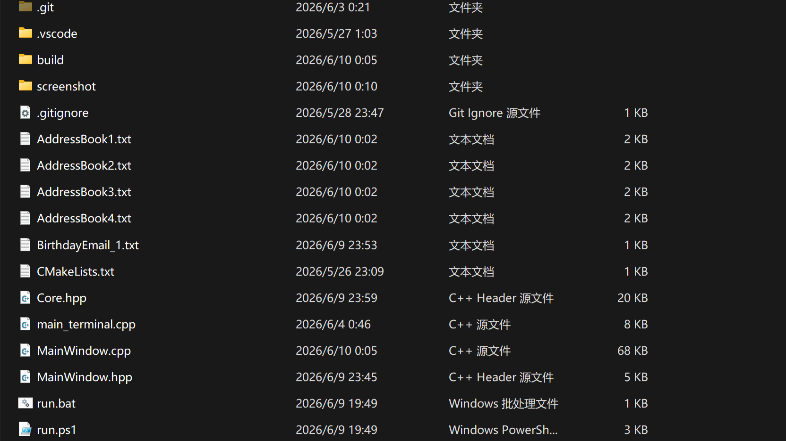

---

## 二、面向对象架构设计

> 本节结论：以抽象基类 Person 为核心的四层派生体系，配合 `vector<unique_ptr<Person>>` 实现多态管理，数据与界面完全分离。

### 2.1 类继承体系

```text
                Person（抽象基类）
           姓名、生日、电话、邮箱
           display() = 0    纯虚函数
           formatForFile() = 0
         ┌──────┬──────┬──────┐
       同学    同事    朋友    亲戚
       +学校   +单位   +地点   +称呼
```

| OOP 特性 | 在项目中的体现 |
|----------|---------------|
| **封装** | 所有数据字段 `protected`，通过 `getName()` `getPhone()` 等公有 getter/setter 访问 |
| **继承** | 四个派生类自动复用基类四字段与接口，仅各自扩展一个专属字段 |
| **多态** | 基类指针调用 `display()` / `formatForFile()`，各子类输出不同内容，调用侧无需判断类型 |

### 2.2 关键代码：基类与派生类

```cpp
class Person {
protected:
    std::string name;
    Date birthDate;
    std::string phone, email;
    int type; // 1=同学 2=同事 3=朋友 4=亲戚
public:
    virtual void display() const = 0;           // 纯虚函数
    virtual std::string formatForFile() const = 0;
    virtual ~Person() = default;
    // getter / setter（只开放电话和邮箱的修改）
};

class Classmate : public Person {
    std::string school;  // 专属字段
public:
    void display() const override {
        std::cout << "[同学] 姓名: " << name
                  << ", 学校: " << school << std::endl;
    }
    std::string formatForFile() const override {
        return name + "," + birth + "," + phone + "," + email + "," + school;
    }
};
// Colleague(+company) / Friend(+place) / Relative(+relation) 同理
```

### 2.3 数据管理层

`AddressBookManager` 是业务中枢，所有联系人统一由 `std::vector<std::unique_ptr<Person>>` 持有：

| 设计决策 | 说明 |
|----------|------|
| `std::vector` | 动态数组，支持下标访问和迭代器遍历 |
| `std::unique_ptr<Person>` | 独占所有权智能指针，离开作用域自动析构，全项目零手动 `delete` |
| 基类指针存派生对象 | 利用多态，`vector` 里存的是 `Classmate` / `Colleague` 等实际对象 |

### 2.4 代码组织与数据流

```text
                    ┌─────────────────┐
                    │    Core.hpp     │  ← 全部业务逻辑，两版共用
                    │  Person 类族    │
                    │  AddressBook   │
                    │  Manager       │
                    └───┬─────────┬──┘
                        │         │
              ┌─────────┘         └─────────┐
              ▼                              ▼
     main_terminal.cpp              MainWindow.cpp/.hpp
     （终端菜单 ~200 行）            （Qt 界面 + AI ~1200 行）
```

> 数据流：用户操作 → 界面层 → `AddressBookManager` 方法 → 内存 `vector<Person>` ⇄ 磁盘 CSV 文件。

---

## 三、核心功能实现

### 3.1 拼音排序

姓名排序使用 Windows `CompareStringW` API，调用系统中文语言排序规则，实现拼音序而非 Unicode 码点序：

```cpp
void sortByName() {
    std::sort(contacts.begin(), contacts.end(),
              [](const auto &a, const auto &b) {
                  auto toWide = [](const std::string &s) -> std::wstring {
                      int len = MultiByteToWideChar(CP_UTF8, 0, s.c_str(), -1, nullptr, 0);
                      std::wstring w(len, L'\0');
                      MultiByteToWideChar(CP_UTF8, 0, s.c_str(), -1, &w[0], len);
                      return w;
                  };
                  return CompareStringW(LOCALE_USER_DEFAULT, 0,
                      toWide(a->getName()).c_str(), -1,
                      toWide(b->getName()).c_str(), -1) == CSTR_LESS_THAN;
              });
}
```

> 非 Windows 平台回退为 `std::string` 默认字典序。

### 3.2 生日检测与跨年处理

核心难点：12 月 31 日向后 5 天跨越到次年 1 月。解决方式：使用 C 标准库 `mktime` 将日期转为时间戳，由系统处理闰年和月份进位。

```cpp
bool isBirthdayWithin5Days(std::string &outWeekday) const {
    time_t now = time(nullptr);
    tm bdayTm = *localtime(&now);
    bdayTm.tm_mon = month - 1;        // 设为生日月日
    bdayTm.tm_mday = day;
    bdayTm.tm_hour = bdayTm.tm_min = bdayTm.tm_sec = 0;

    time_t bdayTime = mktime(&bdayTm);
    if (bdayTime < now) {             // 今年已过 → 推到明年
        bdayTm.tm_year += 1;
        bdayTime = mktime(&bdayTm);
    }

    double diff = difftime(bdayTime, now) / 86400.0;
    if (diff >= 0.0 && diff <= 5.0) {
        static const char *wd[] = {"星期日","星期一","星期二",
            "星期三","星期四","星期五","星期六"};
        outWeekday = wd[bdayTm.tm_wday];
        return true;
    }
    return false;
}
```

> **边界说明**：当天（`diff = 0`）计入，北京时间 `mktime` 自动考虑时区，`localtime` 取本地星期。

### 3.3 查询与统计

| 功能 | 方法 | 实现要点 |
|------|------|----------|
| 按姓名查 | `searchByName` | 遍历比较 `getName() == target` |
| 按姓氏查 | `searchBySurname` | `compare(0, len, surname) == 0` 前缀匹配 |
| 按年份查 | `searchByBirthYear` | 遍历比较 `birthDate.year == year` |
| 按电话/邮箱查 | `searchByPhone` / `searchByEmail` | 精确匹配 |
| 组合筛选 | `filter` | type + surname + year + month 多条件 AND |
| 生日相同 | `findSameBirthday` | 按日期字符串分组，相邻相等即命中 |
| 按月统计 | `countByBirthMonth` | 遍历过滤 + 计数 + 逐个 display |

### 3.4 AI 自然语言交互管线

```text
用户输入："五月生日的同学"（自然语言）
        ↓  DeepSeek API（系统提示词定义 18 种 action + 15 条示例）
AI 返回  {"action":"filter","month":5,"type":"同学"}（结构化 JSON）
        ↓  解析 action 字段
路由到  filter 处理分支 → manager 方法调用
        ↓
结果输出到界面日志区
```

> AI 在本项目中的角色是"意图翻译器"，将自然语言转为结构化命令；所有数据操作仍由 C++ 编写的业务逻辑完成，AI 不直接访问联系人数据。

---

## 四、操作界面展示

> **提示**：以下截图为开发环境测试截图，部分包含示例数据。PPT 制作前建议对姓名、电话、邮箱做脱敏处理（替换为虚拟数据后重新截图），或在此处用红色标注提醒。

### 4.1 主界面

左右分栏布局：左侧六大功能组按钮，右侧数据表格 + 快捷搜索 + AI 输入栏，底部状态栏实时显示四类人数统计。

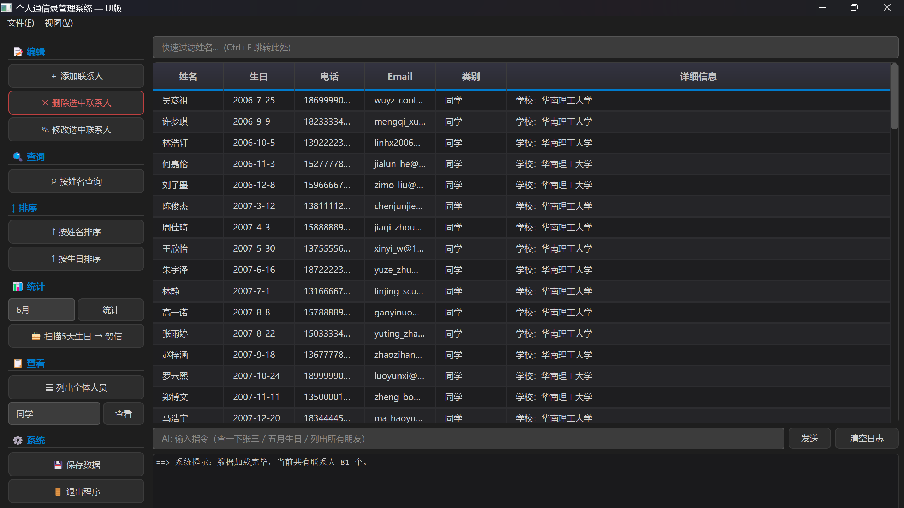

### 4.2 联系人编辑

| 操作 | 入口 | 说明 |
|------|------|------|
| 录入 | `Ctrl+N` / 左侧按钮 | 类别下拉选择，表单填写，姓名不可为空 |
| 修改 | 双击行 / 右键菜单 / 左侧按钮 | 姓名与生日字段灰色锁定，仅可改电话和邮箱 |
| 删除 | `Delete` / 右键菜单 / 左侧按钮 | 确认对话框防误删，`Ctrl+Z` 撤销恢复 |

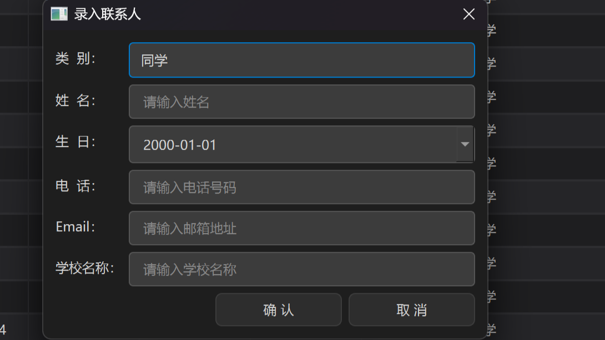

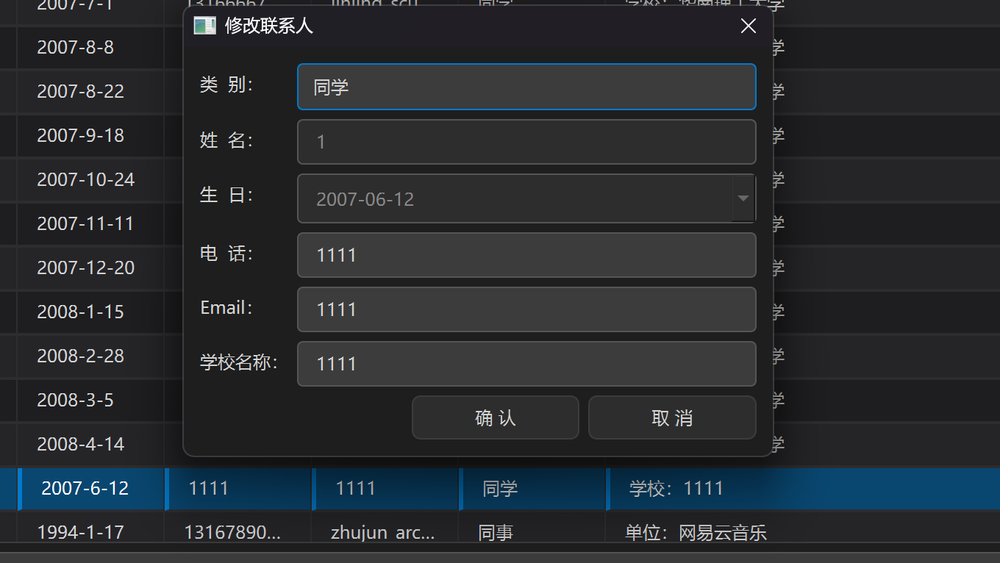

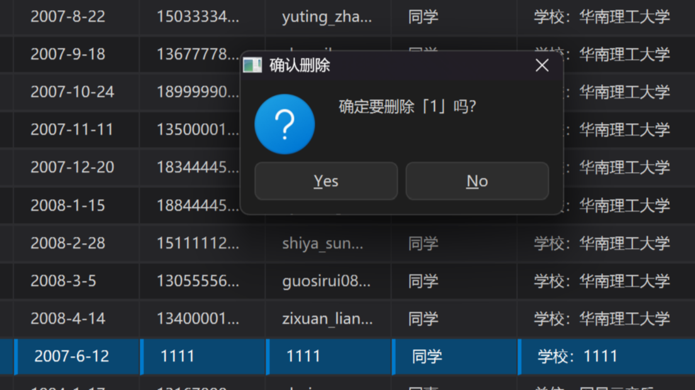

### 4.3 查询与排序

| 操作 | 方式 |
|------|------|
| 按姓名查询 | 左侧按钮 → 弹框输入 → 结果显示日志区 |
| 表头排序 | 点击"姓名"/"生日"列头，▲▼ 箭头指示方向，升降交替 |
| 侧边栏排序 | 按钮文字随方向切换 ↑/↓，与表头联动 |
| 快捷过滤 | 表格上方搜索框，输入即时隐藏不匹配行，`Ctrl+F` 聚焦 |

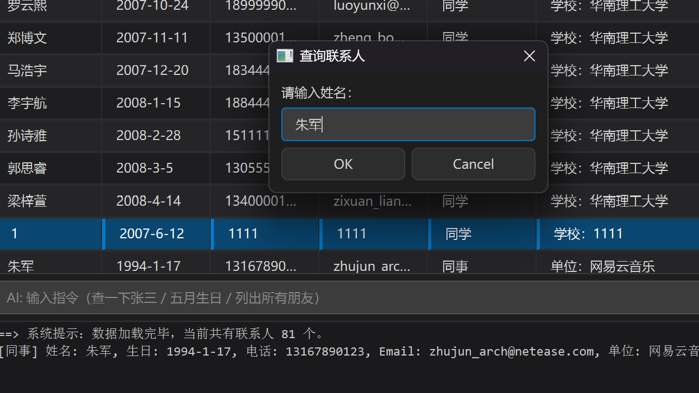

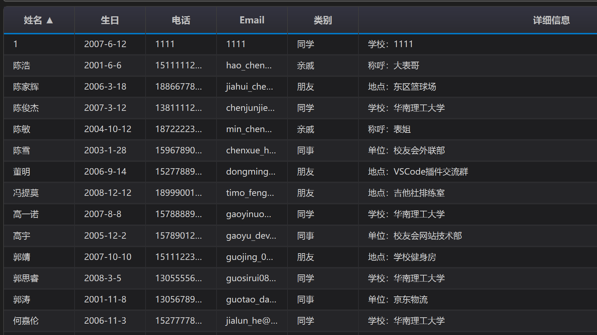

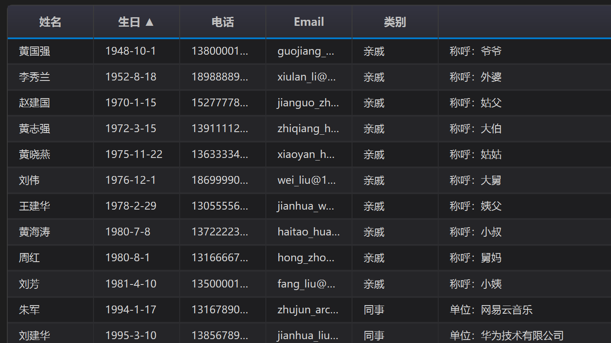

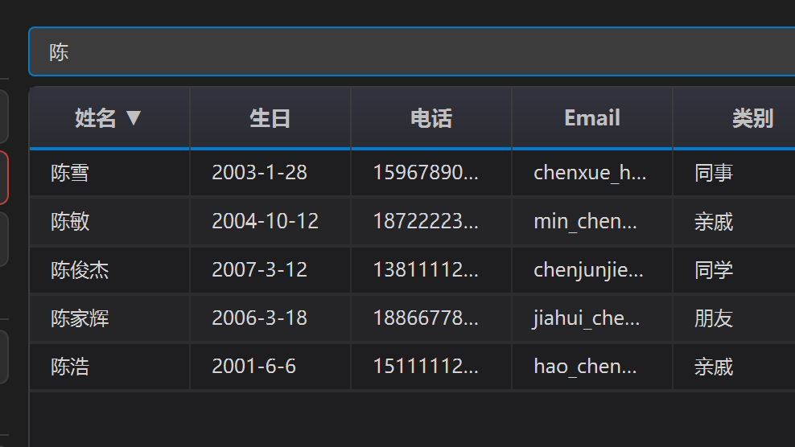

### 4.4 统计与生日贺信

| 操作 | 说明 |
|------|------|
| 按月统计 | 下拉框选 1~12 月，列出该月全部生日人员及总数 |
| 贺信扫描 | 一键扫描未来 5 天，显示星期几，自动生成 `.txt` 贺信文件 |
| 发件人设置 | 文件菜单 → 设置发件人姓名，贺信署名随设置变化 |

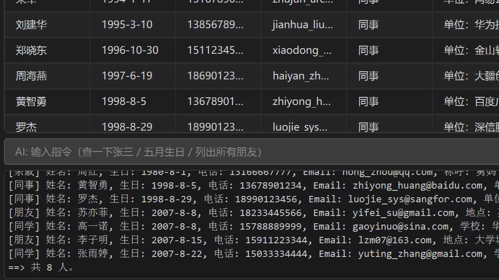

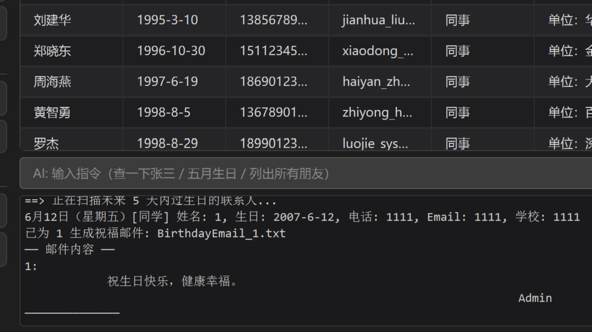

### 4.5 AI 自然语言交互

支持查询、添加、删除、修改、排序、统计、生日扫描等全部基础功能，以自然语言驱动。

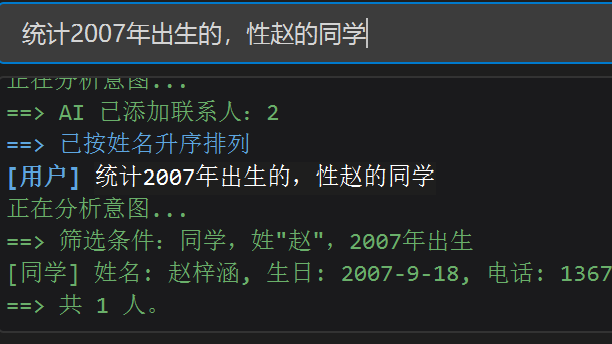

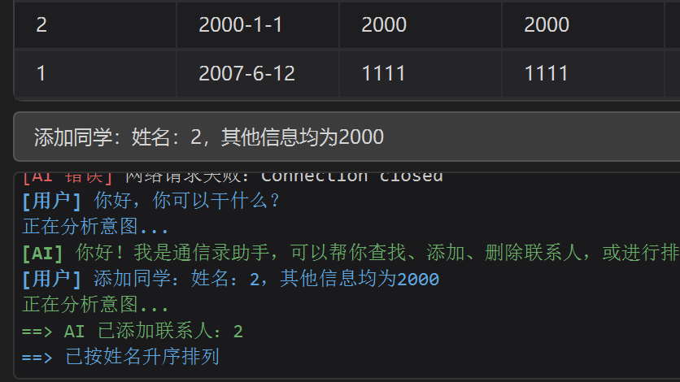

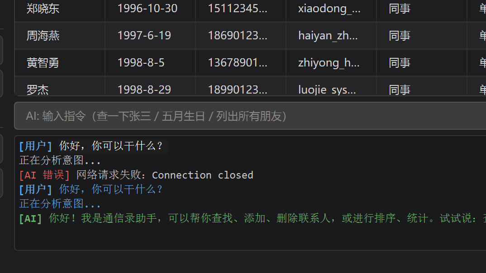

### 4.6 数据可视化与主题

| 操作 | 说明 |
|------|------|
| 统计图表 | 视图菜单 → QPainter 自绘饼图（四类占比）+ 柱状图（每月生日人数） |
| 主题切换 | 视图菜单 → 暗色/亮色全局样式一键切换 |

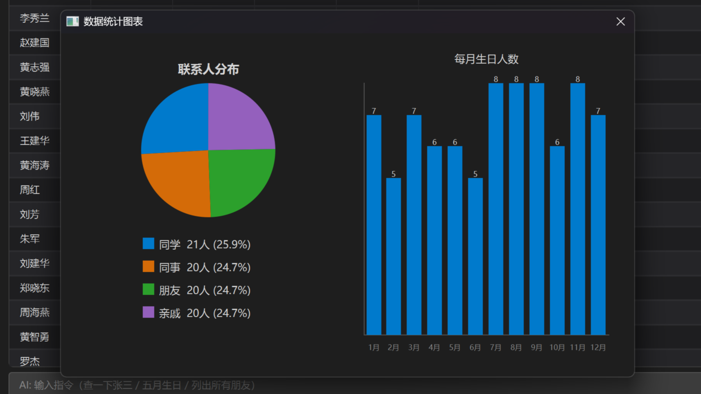

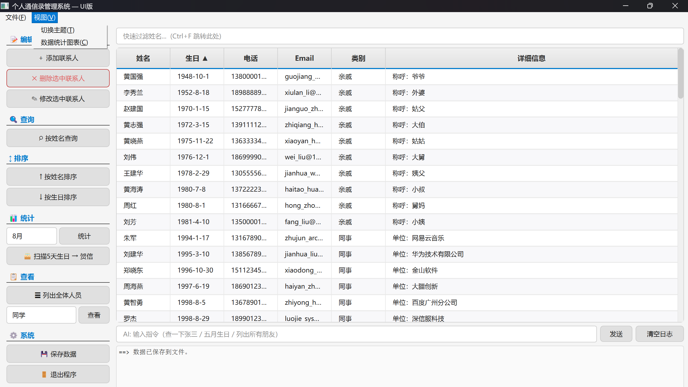

---

## 五、创新与扩展

> 以下功能均为基础任务完成后的扩展，不影响任务书要求评分的独立性。

### 5.1 Qt6 图形界面

| 项目 | 说明 |
|------|------|
| 学习起点 | 零 Qt 基础，通过官方文档与教程自学 |
| 核心机制 | 信号槽（signal-slot）驱动的异步响应用户操作 |
| 自定义主题 | 手写 QSS 样式表，暗色/亮色两套完整配色 |
| 交互增强 | 表头排序、右键菜单、双击编辑、快捷键、即时搜索过滤、状态栏统计 |

### 5.2 AI 大模型接入

将寒假 LLM 小项目中学到的"自然语言 → JSON 命令 → 函数路由"模式迁移到本项目中。系统提示词定义了 18 种操作和 15 条示例，支持单条件查询、组合条件筛选、编辑操作、闲聊兜底。

> AI 仅做意图识别与参数提取，不接触联系人数据，不参与业务决策。所有增删改查仍由 `AddressBookManager` 的 C++ 方法执行。

### 5.3 数据可视化

不依赖第三方图表库，使用 Qt 的 `QPainter` 自绘饼图和柱状图，实时从 `vector<Person>` 统计数据，自适应暗色/亮色主题的文字颜色。

### 5.4 撤销与主题切换

- **撤销**：基于操作快照的简易撤销机制，`Ctrl+Z` 撤回最近一次增/删/改，覆盖手动操作和 AI 操作。
- **主题**：双套完整 QSS，全局控件样式一次切换生效。

---

## 六、踩坑与反思

| # | 问题 | 原因 | 解决 | 反思 |
|:--|------|------|------|------|
| 1 | 中文文件名乱码 | `std::ofstream` 默认 GBK，源码 UTF-8 | `MultiByteToWideChar` 转宽字符路径 | 涉中文项目第一步就确定编码方案 |
| 2 | Qt6 "无法定位程序输入点" | GCC 版本低，DLL 版本不匹配 | 升级 MSYS2 工具链 | 编译通过≠环境正确，入口点报错先查版本 |
| 3 | 终端版与 Core.hpp 代码重复 | 初期独立开发两套代码 | Core.hpp 去 Qt 依赖，终端直接 `#include` | 代码能用≠好维护，DRY 原则从小项目做起 |
| 4 | Unicode 码点序 ≠ 拼音序 | `std::string` 按字节比 | 换用 `CompareStringW` 系统拼音排序 | 字符串比较依赖语言环境，不是简单的字节序 |

---

## 七、总结

本项目作为大一 C++ 课程的结课大作业，完整实现了任务书的八条功能要求和三条补充提示。

**面向对象设计**：以抽象基类 `Person` 为核心构建四类派生体系，封装、继承、多态在 `display()` 和 `formatForFile()` 的虚函数机制中落地。`std::vector<std::unique_ptr<Person>>` 结合智能指针实现安全、自动的内存管理。

**代码复用**：`Core.hpp` 被终端版和 UI 版共同引用，业务逻辑只写一次，修改同步生效。

**扩展能力**：在满足全部基础要求的前提下，完成了 Qt6 图形界面、AI 自然语言交互、数据可视化、撤销操作等扩展功能。

**个人体会**：通过本项目，对 C++ 面向对象编程从"课本概念"走向了"工程实践"。开发过程中，通过查阅文档、分析调试信息和借助工具辅助，完成了方案设计到功能迭代的完整流程。后续学习中将继续夯实 C++ 基础能力，同时保持对新技术和工具的关注。

---

*2026 年 6 月 10 日*
